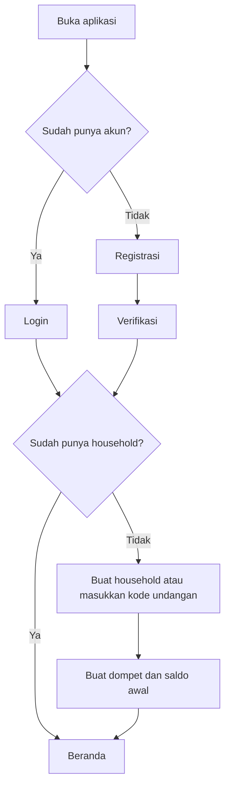
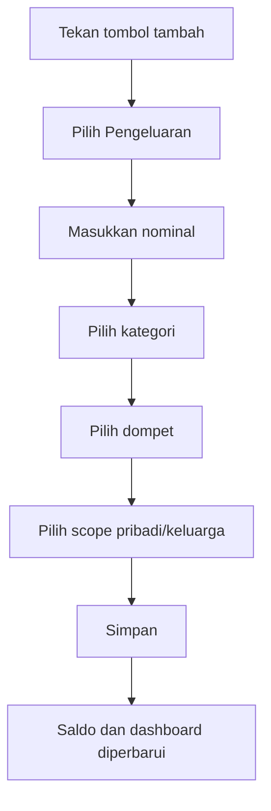
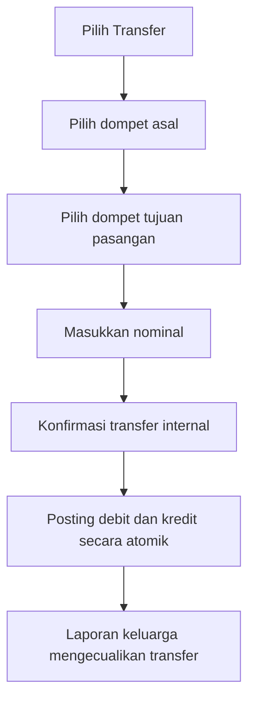
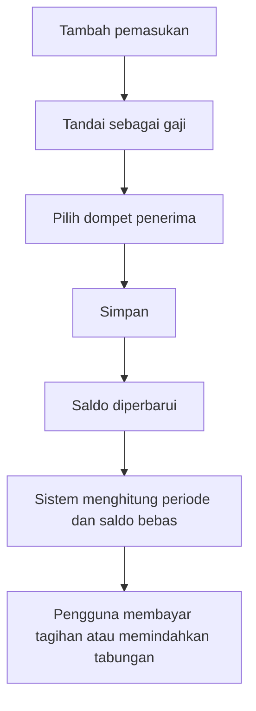
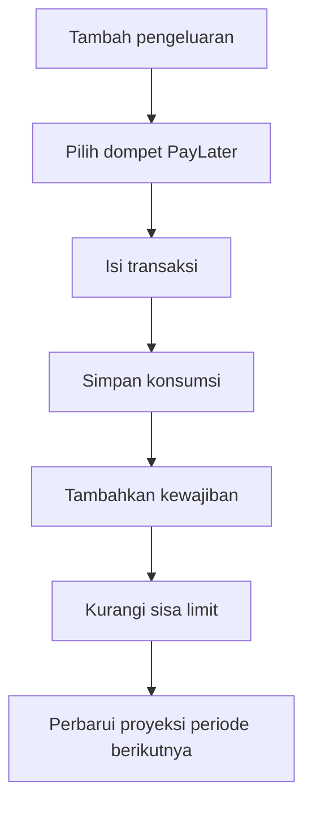
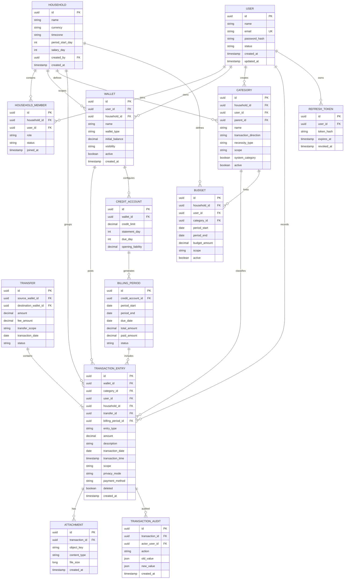
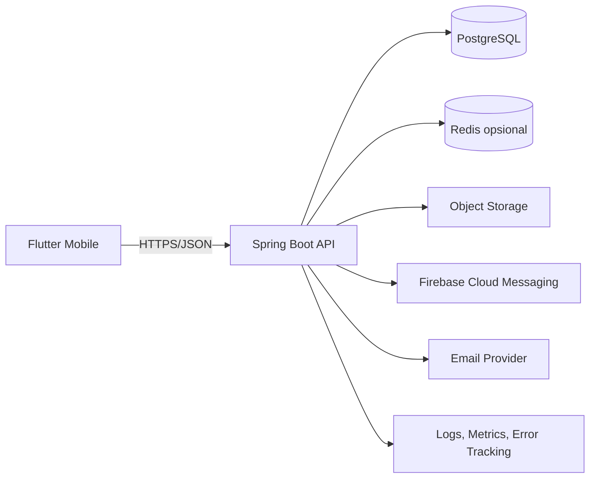

# Bekara

## Product Requirements & Technical Specification

| Informasi | Nilai |
|---|---|
| Nama produk | Bekara |
| Jenis aplikasi | Aplikasi mobile pencatatan dan pengendalian keuangan rumah tangga |
| Status dokumen | Draft siap implementasi |
| Versi dokumen | 0.1.0 |
| Tanggal | 4 Agustus 2026 |
| Platform awal | Android dan iOS melalui Flutter |
| Arsitektur backend | Modular monolith |
| Bahasa dokumen | Indonesia |

---

> **Pembaruan arsitektur 4 Agustus 2026:** implementasi pribadi awal menggunakan Flutter + Drift/SQLite + Supabase Free. Rancangan Spring Boot pada bagian 12 merupakan rancangan lama dan tidak lagi menjadi baseline implementasi. Detail kanonis tersedia pada [indeks dokumentasi teknis](docs/README.md) dan [architecture decision](docs/architecture-decision.md). Google Spreadsheet dipertahankan sebagai alternatif/fallback dan target ekspor, bukan sumber kebenaran utama.

## 1. Ringkasan Produk

Bekara adalah aplikasi untuk mencatat keuangan pribadi dan rumah tangga, mengetahui posisi saldo gabungan suami–istri, mengendalikan pengeluaran sampai periode gajian berikutnya, serta mengelola kewajiban seperti tagihan dan PayLater.

Aplikasi bukan bank digital dan pada MVP tidak terhubung langsung ke rekening bank. Seluruh transaksi dicatat manual atau diimpor melalui CSV. Proses pencatatan harus sederhana dan ditargetkan selesai dalam kurang dari 10 detik untuk transaksi umum.

### 1.1 Nilai utama produk

1. Saldo pribadi dan saldo keluarga dapat dilihat secara terpisah.
2. Transfer antaranggota keluarga tidak dihitung sebagai pengeluaran keluarga.
3. Periode laporan dapat mengikuti tanggal gajian, bukan hanya tanggal 1–31.
4. Aplikasi menghitung batas aman pengeluaran harian sampai periode berikutnya.
5. Transaksi PayLater dicatat sebagai konsumsi saat terjadi dan sebagai kewajiban yang harus dibayar di masa depan.
6. Privasi transaksi pribadi tetap dijaga di dalam satu rumah tangga.

### 1.2 Contoh kasus utama

- Rendy membeli makan siang: pengeluaran pribadi.
- Rendy membayar listrik: pengeluaran keluarga.
- Rendy mentransfer Rp2.000.000 ke Asqa: transfer internal keluarga.
- Asqa membeli pampers: pengeluaran keluarga.
- Asqa membeli kopi: pengeluaran pribadi.

---

## 2. Tujuan dan Indikator Keberhasilan

### 2.1 Tujuan produk

Aplikasi harus membantu pengguna menjawab:

- Berapa saldo yang tersedia saat ini?
- Berapa saldo pribadi dan saldo keluarga?
- Apakah saldo cukup sampai tanggal gajian berikutnya?
- Berapa batas aman pengeluaran per hari?
- Berapa pengeluaran masing-masing anggota?
- Berapa pengeluaran keluarga yang sebenarnya?
- Berapa tagihan PayLater periode berikutnya?
- Berapa dana yang benar-benar berhasil ditabung?
- Kategori apa yang paling besar atau paling sering menyebabkan kebocoran keuangan?

### 2.2 Indikator keberhasilan MVP

| ID | Indikator | Target awal |
|---|---|---:|
| KPI-01 | Waktu pencatatan transaksi umum | ≤ 10 detik |
| KPI-02 | Keberhasilan penyimpanan transaksi | ≥ 99% |
| KPI-03 | Akurasi saldo berdasarkan ledger | 100% |
| KPI-04 | Transfer internal masuk laporan keluarga sebagai pengeluaran | 0 kasus |
| KPI-05 | Waktu muat dashboard pada jaringan normal | ≤ 2 detik |
| KPI-06 | Crash-free session aplikasi mobile | ≥ 99,5% |
| KPI-07 | Pengguna aktif yang mencatat transaksi minimal 5 hari per minggu | Diukur setelah peluncuran |

---

## 3. Ruang Lingkup

### 3.1 Scope MVP — P0

Fitur berikut wajib tersedia pada rilis MVP:

1. Registrasi, login, logout, refresh token, dan reset password.
2. Pembuatan rumah tangga.
3. Undangan pasangan dan keanggotaan rumah tangga.
4. Pengelolaan dompet.
5. Kategori bawaan dan kategori kustom.
6. Pemasukan.
7. Pengeluaran.
8. Transfer antar-dompet.
9. Transfer internal antaranggota rumah tangga.
10. Penyesuaian saldo.
11. Periode keuangan berdasarkan tanggal gajian.
12. Dashboard saldo dan cash flow.
13. Laporan berdasarkan periode, anggota, kategori, dan dompet.
14. Privasi transaksi pribadi.
15. Audit trail dasar untuk perubahan transaksi.

### 3.2 Scope MVP — P1

Fitur berikut tetap bagian dari sasaran MVP, tetapi dapat dirilis setelah P0 stabil:

1. Anggaran per kategori, pengguna, atau rumah tangga.
2. Tagihan rutin.
3. PayLater dan kartu kredit.
4. Prediksi saldo sampai gajian.
5. Batas aman pengeluaran harian.
6. Notifikasi batas anggaran dan jatuh tempo.
7. Import transaksi dari CSV.
8. Lampiran nota.

### 3.3 Di luar scope MVP

- Sinkronisasi langsung dengan rekening bank.
- Open banking.
- OCR nota otomatis.
- Pencatatan melalui bahasa alami.
- Rekomendasi keuangan berbasis AI.
- Deteksi transaksi otomatis dari notifikasi bank.
- Investasi atau perdagangan aset.
- Pinjaman atau penyediaan kredit.
- Multi-household untuk satu pengguna.
- Microservices.

---

## 4. Target Pengguna dan Peran

### 4.1 Persona utama

#### Persona A — Pemilik rumah tangga

- Membuat rumah tangga.
- Mengundang pasangan.
- Mengatur periode keuangan.
- Mengelola kategori keluarga.
- Melihat laporan keluarga sesuai aturan privasi.

#### Persona B — Anggota rumah tangga

- Menerima undangan.
- Membuat dompet pribadi atau keluarga.
- Mencatat transaksi pribadi dan keluarga.
- Melihat laporan yang diizinkan.

### 4.2 Peran aplikasi

| Peran | Keterangan |
|---|---|
| `HOUSEHOLD_OWNER` | Pembuat dan pengelola utama rumah tangga |
| `HOUSEHOLD_MEMBER` | Anggota rumah tangga |

### 4.3 Matriks hak akses

| Aksi | Owner | Member |
|---|:---:|:---:|
| Melihat profil sendiri | Ya | Ya |
| Mengubah profil sendiri | Ya | Ya |
| Membuat rumah tangga | Ya | Ya, apabila belum tergabung |
| Mengubah pengaturan rumah tangga | Ya | Tidak |
| Mengundang anggota | Ya | Tidak |
| Mengeluarkan anggota | Ya | Tidak |
| Membuat dompet pribadi | Ya | Ya |
| Membuat dompet keluarga | Ya | Ya |
| Melihat rincian transaksi privat anggota lain | Tidak | Tidak |
| Melihat total agregat keluarga | Ya | Ya |
| Membuat kategori keluarga | Ya | Ya |
| Mengubah kategori sistem | Tidak | Tidak |

---

## 5. Terminologi

| Istilah | Definisi |
|---|---|
| Rumah tangga | Grup keuangan yang berisi suami, istri, atau anggota keluarga lain pada versi berikutnya |
| Dompet | Sumber atau tempat penyimpanan uang, misalnya bank, cash, e-wallet, tabungan, kartu kredit, atau PayLater |
| Scope transaksi | Penanda apakah transaksi termasuk `PRIVATE` atau `HOUSEHOLD` |
| Transfer internal | Transfer antara dua dompet yang masih berada dalam rumah tangga yang sama |
| Periode keuangan | Rentang laporan berdasarkan tanggal awal dan akhir yang dapat mengikuti tanggal gajian |
| Saldo buku | Saldo yang dihitung dari saldo awal dan seluruh transaksi yang tervalidasi |
| Saldo bebas | Saldo kas yang dapat dipakai setelah dikurangi dana terkunci dan kewajiban terdekat |
| Dana terkunci | Dana yang tidak boleh dipakai untuk konsumsi umum, misalnya dana darurat atau tabungan tujuan |
| Kewajiban | Nilai yang harus dibayar, misalnya PayLater, kartu kredit, dan tagihan rutin |

---

## 6. Aturan Bisnis Utama

### BR-001 — Sumber saldo

Saldo dompet tidak boleh menjadi angka bebas yang diubah langsung tanpa jejak. Saldo dihitung dari:

```text
saldo_berjalan = saldo_awal
                + total_pemasukan
                - total_pengeluaran
                + transfer_masuk
                - transfer_keluar
                + total_penyesuaian
```

Penyesuaian saldo harus menghasilkan transaksi tipe `ADJUSTMENT` dan menyimpan alasan perubahan.

### BR-002 — Transfer internal keluarga

Apabila dompet asal dan tujuan berada dalam rumah tangga yang sama:

- Saldo dompet asal berkurang.
- Saldo dompet tujuan bertambah.
- Pada laporan pribadi, transfer keluar dan masuk tetap terlihat sebagai perpindahan saldo.
- Pada laporan keluarga, transfer tidak dihitung sebagai pemasukan ataupun pengeluaran.
- Transfer dibuat secara atomik: kedua sisi berhasil atau keduanya dibatalkan.

### BR-003 — Scope transaksi

Setiap transaksi memiliki salah satu scope:

- `PRIVATE`: transaksi milik pengguna dan tidak ditampilkan rinci kepada anggota lain.
- `HOUSEHOLD`: transaksi yang memengaruhi laporan keluarga dan dapat dilihat anggota rumah tangga.

### BR-004 — Privasi transaksi

Untuk transaksi `PRIVATE` milik pengguna lain:

- Pasangan tidak dapat melihat deskripsi.
- Pasangan tidak dapat melihat lampiran.
- Pasangan tidak dapat melihat kategori rinci apabila pengguna memilih mode privasi penuh.
- Nilai dapat masuk agregat saldo rumah tangga hanya apabila dompet disetel terlihat untuk keluarga.
- Laporan kontribusi tidak boleh memakai bahasa yang menghakimi seperti “lebih boros”.

Mode privasi awal:

| Mode | Detail yang terlihat oleh pasangan |
|---|---|
| `PRIVATE_FULL` | Hanya total saldo dompet jika dompet dibagikan |
| `PRIVATE_SUMMARY` | Nominal dan tanggal tanpa deskripsi/lampiran |
| `HOUSEHOLD_VISIBLE` | Seluruh detail transaksi |

### BR-005 — Periode gajian

Periode keuangan dapat melintasi bulan kalender. Contoh:

```text
Awal periode : tanggal 25
Akhir periode: tanggal 24 bulan berikutnya
```

Apabila `period_start_day` lebih besar daripada jumlah hari pada suatu bulan, sistem memakai hari terakhir bulan tersebut.

### BR-006 — Pemasukan gaji

Pemasukan dapat ditandai sebagai `SALARY`. Gaji aktual tetap harus dicatat sebagai transaksi. Pengaturan tanggal gajian hanya dipakai untuk pembentukan periode, proyeksi, dan pengingat.

### BR-007 — Pengeluaran PayLater

Pada transaksi PayLater:

- Konsumsi dicatat pada tanggal pembelian.
- Kas tidak langsung berkurang.
- Saldo limit PayLater berkurang.
- Kewajiban periode tagihan bertambah.
- Pembayaran tagihan mengurangi kas dan kewajiban, tetapi tidak dihitung kembali sebagai konsumsi.

### BR-008 — Kartu kredit

Kartu kredit mengikuti aturan yang sama dengan PayLater, tetapi dapat memiliki tanggal cetak tagihan, tanggal jatuh tempo, limit, minimum payment, dan bunga opsional.

### BR-009 — Tabungan

Pemindahan uang dari rekening ke dompet tabungan milik rumah tangga yang sama adalah transfer, bukan pengeluaran. Nilai “berhasil ditabung” dihitung dari kenaikan bersih dompet bertipe `SAVING` dalam periode.

### BR-010 — Penghapusan transaksi

Penghapusan transaksi menggunakan soft delete. Saldo dan laporan harus dihitung ulang berdasarkan transaksi aktif. Transfer hanya dapat dibatalkan sebagai satu pasangan transaksi.

### BR-011 — Mata uang

MVP hanya mendukung satu mata uang per rumah tangga. Nilai default adalah `IDR`. Seluruh nominal disimpan sebagai bilangan desimal, bukan floating point.

### BR-012 — Zona waktu

Tanggal dan waktu disimpan dalam UTC. Tampilan menggunakan zona waktu rumah tangga, dengan default `Asia/Jakarta`.

---

## 7. Kebutuhan Fungsional

## 7.1 Autentikasi dan pengguna

### FR-AUTH-001 — Registrasi

Pengguna dapat mendaftar dengan nama, email, dan kata sandi.

**Acceptance criteria:**

- Email harus unik dan dinormalisasi menjadi huruf kecil.
- Kata sandi minimal 8 karakter.
- Kata sandi disimpan sebagai hash yang aman.
- Sistem mengirim verifikasi email apabila layanan email tersedia.

### FR-AUTH-002 — Login

Pengguna dapat login menggunakan email dan kata sandi.

**Acceptance criteria:**

- Respons berisi access token dan refresh token.
- Access token memiliki masa aktif pendek.
- Refresh token dapat dicabut saat logout.
- Percobaan login gagal dibatasi.

### FR-AUTH-003 — Reset password

Pengguna dapat meminta tautan atau OTP reset password.

### FR-USER-001 — Profil pengguna

Pengguna dapat mengubah nama, foto profil opsional, zona waktu, dan preferensi format angka.

---

## 7.2 Rumah tangga

### FR-HH-001 — Membuat rumah tangga

Pengguna yang belum tergabung dapat membuat rumah tangga.

Field wajib:

- Nama rumah tangga.
- Mata uang.
- Zona waktu.
- Tanggal awal periode.
- Tanggal gajian default.

### FR-HH-002 — Mengundang pasangan

Owner dapat membuat undangan menggunakan email atau kode undangan.

**Acceptance criteria:**

- Undangan memiliki masa berlaku.
- Satu undangan hanya dapat digunakan satu kali.
- Pengguna tidak dapat menjadi anggota dua rumah tangga pada MVP.

### FR-HH-003 — Bergabung ke rumah tangga

Pengguna dapat menerima undangan dan menjadi `HOUSEHOLD_MEMBER`.

### FR-HH-004 — Keluar atau dikeluarkan

- Member dapat keluar dari rumah tangga.
- Owner dapat mengeluarkan member.
- Owner tidak dapat keluar sebelum memindahkan kepemilikan atau membubarkan rumah tangga.
- Riwayat transaksi tidak dihapus otomatis.

---

## 7.3 Dompet

### FR-WALLET-001 — Membuat dompet

Jenis dompet:

```text
BANK_ACCOUNT
CASH
E_WALLET
CREDIT_CARD
PAYLATER
SAVING
OTHER
```

Field:

- Nama.
- Pemilik.
- Jenis.
- Saldo awal.
- Scope atau visibilitas.
- Mata uang.
- Ikon opsional.
- Status aktif.

### FR-WALLET-002 — Mengubah dompet

Nama, ikon, visibilitas, dan status dompet dapat diubah. Saldo awal hanya dapat diubah melalui penyesuaian yang diaudit setelah dompet memiliki transaksi.

### FR-WALLET-003 — Menonaktifkan dompet

Dompet dengan riwayat transaksi tidak dihapus permanen. Dompet dinonaktifkan dan tidak muncul sebagai pilihan default.

### FR-WALLET-004 — Rekonsiliasi saldo

Pengguna dapat memasukkan saldo aktual. Sistem membuat transaksi penyesuaian sebesar selisih saldo buku dan saldo aktual.

---

## 7.4 Kategori

### FR-CAT-001 — Kategori bawaan

Kategori awal:

#### Kebutuhan pokok

- Pangan dan dapur.
- Makanan utama.
- Transportasi.
- Operasional dan tagihan.
- Keluarga dan anak.
- Kesehatan.
- Pendidikan.

#### Keinginan

- Jajan dan kopi.
- Hiburan.
- Self-care.
- Belanja.
- Hadiah.
- Langganan.

#### Keuangan

- Tabungan.
- Investasi.
- Cicilan.
- PayLater.
- Utang-piutang.
- Transfer internal.

### FR-CAT-002 — Kategori kustom

Pengguna dapat membuat kategori pribadi atau keluarga dengan nama, ikon, jenis pemasukan/pengeluaran, dan klasifikasi wajib/fleksibel.

### FR-CAT-003 — Arsip kategori

Kategori yang sudah digunakan tidak dapat dihapus permanen. Kategori dapat diarsipkan.

---

## 7.5 Transaksi

### FR-TRX-001 — Jenis transaksi

```text
INCOME
EXPENSE
TRANSFER
DEBT
BILL_PAYMENT
ADJUSTMENT
```

Untuk implementasi ledger, transfer dapat disimpan sebagai header transfer dan dua posting transaksi.

### FR-TRX-002 — Membuat pengeluaran

Field minimum:

- Nominal.
- Kategori.
- Dompet.
- Tanggal transaksi.
- Scope.

Field opsional:

- Deskripsi.
- Metode pembayaran.
- Label.
- Lokasi.
- Lampiran nota.

### FR-TRX-003 — Membuat pemasukan

Pengguna dapat menandai pemasukan sebagai gaji, bonus, pengembalian dana, hadiah, penjualan, atau lainnya.

### FR-TRX-004 — Membuat transfer

Field:

- Dompet asal.
- Dompet tujuan.
- Nominal.
- Tanggal.
- Biaya admin opsional.
- Keterangan.

Biaya admin, apabila ada, dicatat sebagai pengeluaran terpisah.

### FR-TRX-005 — Ubah transaksi

Pengguna dapat mengubah transaksi miliknya. Perubahan nominal, dompet, tanggal, kategori, dan scope harus tercatat dalam audit log.

### FR-TRX-006 — Hapus transaksi

Pengguna dapat menghapus transaksi miliknya. Transfer harus dibatalkan secara utuh.

### FR-TRX-007 — Daftar transaksi

Daftar transaksi dapat difilter berdasarkan:

- Periode.
- Pemilik.
- Dompet.
- Kategori.
- Jenis.
- Scope.
- Nominal minimum dan maksimum.
- Kata kunci.

### FR-TRX-008 — Transaksi cepat

Aplikasi menyimpan pilihan terakhir pengguna untuk kategori, dompet, dan scope secara lokal agar pencatatan berikutnya lebih cepat.

### FR-TRX-009 — Lampiran nota

Pengguna dapat mengunggah foto atau PDF nota. File tidak boleh dapat diakses tanpa otorisasi.

---

## 7.6 Anggaran

### FR-BUDGET-001 — Membuat anggaran

Anggaran dapat dibuat berdasarkan:

- Pengguna.
- Rumah tangga.
- Kategori.
- Periode keuangan.

### FR-BUDGET-002 — Progres anggaran

Sistem menampilkan:

- Batas anggaran.
- Total terpakai.
- Sisa.
- Persentase.
- Rata-rata pemakaian harian.
- Proyeksi akhir periode.

### FR-BUDGET-003 — Status anggaran

```text
SAFE        : penggunaan < 70%
WARNING     : penggunaan 70%–89,99%
CRITICAL    : penggunaan 90%–99,99%
EXCEEDED    : penggunaan ≥ 100%
```

Persentase ambang dapat dibuat configurable pada versi berikutnya.

### FR-BUDGET-004 — Notifikasi

Sistem dapat mengirim notifikasi pada 70%, 90%, dan 100% penggunaan anggaran.

---

## 7.7 Periode keuangan dan proyeksi

### FR-PERIOD-001 — Pengaturan periode

Pengguna dapat menentukan:

- Tanggal awal periode.
- Tanggal gajian.
- Frekuensi pemasukan.
- Hari kerja.

### FR-PERIOD-002 — Pembentukan periode otomatis

Sistem membuat periode saat ini dan periode berikutnya secara dinamis berdasarkan konfigurasi rumah tangga.

### FR-FORECAST-001 — Saldo bebas

Rumus awal:

```text
saldo_kas_tersedia
= total saldo dompet kas aktif
- dana terkunci
- tagihan jatuh tempo sebelum gajian berikutnya
- kebutuhan rutin tersisa
```

Dompet kas mencakup `BANK_ACCOUNT`, `CASH`, dan `E_WALLET`. Dompet `CREDIT_CARD` serta `PAYLATER` tidak dihitung sebagai kas.

### FR-FORECAST-002 — Batas aman harian

```text
batas_aman_harian
= max(0, saldo_kas_tersedia / jumlah_hari_tersisa)
```

Pengguna dapat memilih pembagi hari kalender atau hari aktif.

### FR-FORECAST-003 — Status kesehatan cash flow

Status awal:

- `SAFE`: saldo bebas mampu menutup proyeksi kebutuhan sampai gajian.
- `CONTROL_NEEDED`: saldo bebas positif tetapi di bawah proyeksi kebutuhan.
- `DEFICIT_RISK`: saldo bebas nol atau negatif.

### FR-FORECAST-004 — Transparansi perhitungan

Pengguna dapat membuka rincian komponen yang membentuk saldo bebas dan batas harian.

---

## 7.8 PayLater dan tagihan

### FR-PL-001 — Konfigurasi PayLater

Field:

- Nama penyedia.
- Limit.
- Tanggal cetak tagihan.
- Tanggal jatuh tempo.
- Saldo kewajiban awal.
- Status aktif.

### FR-PL-002 — Transaksi PayLater

Transaksi PayLater harus:

- Masuk laporan konsumsi pada tanggal pembelian.
- Menambah kewajiban.
- Mengurangi sisa limit.
- Masuk ke periode tagihan yang sesuai.

### FR-PL-003 — Pembayaran tagihan

Pembayaran tagihan:

- Mengurangi saldo dompet sumber.
- Mengurangi saldo kewajiban.
- Tidak menambah pengeluaran konsumsi untuk kedua kalinya.
- Dapat berupa pembayaran penuh atau sebagian.

### FR-PL-004 — Dashboard PayLater

Menampilkan:

- Tagihan berjalan.
- Jatuh tempo terdekat.
- Limit.
- Sisa limit.
- Total makanan.
- Total nonmakanan.
- Status pembayaran.

---

## 7.9 Dashboard

### FR-DASH-001 — Ringkasan utama

Bagian atas:

- Total saldo pribadi.
- Total saldo keluarga.
- Sisa hari menuju gajian.
- Batas aman per hari.

Bagian tengah:

- Pengeluaran periode berjalan.
- Anggaran terpakai.
- Tagihan akan datang.
- Kewajiban PayLater berjalan.

Bagian bawah:

- Transaksi terbaru.
- Pengeluaran terbesar.
- Kategori dengan pengeluaran tertinggi.
- Tombol tambah transaksi.

### FR-DASH-002 — Scope dashboard

Pengguna dapat berpindah antara:

- `Pribadi`.
- `Keluarga`.

### FR-DASH-003 — Empty state

Apabila belum ada transaksi, dashboard menampilkan langkah awal untuk menambah dompet, saldo awal, dan transaksi pertama.

---

## 7.10 Laporan

### FR-REPORT-001 — Jenis laporan

- Pengeluaran pribadi.
- Pengeluaran pasangan dalam bentuk yang diizinkan privasi.
- Pengeluaran keluarga.
- Pemasukan.
- Per kategori.
- Per dompet.
- Per metode pembayaran.
- Per hari.
- Per minggu.
- Per periode gajian.
- Tagihan PayLater.
- Pengeluaran wajib dan fleksibel.
- Perbandingan periode sebelumnya.

### FR-REPORT-002 — Aturan agregasi

- Transfer internal dikecualikan dari pemasukan dan pengeluaran keluarga.
- Pembayaran tagihan PayLater tidak dihitung sebagai konsumsi kedua.
- Transfer ke tabungan tidak dihitung sebagai pengeluaran konsumsi.
- Transaksi soft-deleted dikecualikan.

### FR-REPORT-003 — Ekspor

P1: laporan dapat diekspor menjadi CSV. Ekspor PDF berada di luar MVP.

---

## 7.11 Import CSV

### FR-IMPORT-001 — Unggah file

Pengguna dapat mengunggah CSV dengan maksimum ukuran configurable, default 5 MB.

### FR-IMPORT-002 — Pemetaan kolom

Kolom minimum:

- Tanggal.
- Nominal.
- Jenis transaksi atau tanda debit/kredit.
- Deskripsi.

Kolom opsional:

- Kategori.
- Dompet.
- Metode pembayaran.

### FR-IMPORT-003 — Preview dan validasi

Sebelum disimpan, aplikasi menampilkan:

- Baris valid.
- Baris gagal.
- Dugaan duplikat.
- Hasil pemetaan kategori.

### FR-IMPORT-004 — Idempotensi

Import yang sama tidak boleh otomatis menggandakan transaksi. Sistem menyimpan hash sumber atau kunci deduplikasi.

---

## 8. User Flow Utama

### 8.1 Onboarding



### 8.2 Mencatat pengeluaran



### 8.3 Transfer ke pasangan



### 8.4 Menerima gaji



### 8.5 Transaksi PayLater



---

## 9. Struktur Navigasi Mobile

Bottom navigation:

1. **Beranda**
2. **Transaksi**
3. **Anggaran**
4. **Laporan**
5. **Profil**

Tombol tambah transaksi menggunakan floating action button di tengah atau posisi yang paling mudah dijangkau.

### 9.1 Daftar layar MVP

| ID | Layar |
|---|---|
| SCR-001 | Splash dan pemeriksaan sesi |
| SCR-002 | Login |
| SCR-003 | Registrasi |
| SCR-004 | Lupa password |
| SCR-005 | Onboarding household |
| SCR-006 | Buat/join household |
| SCR-007 | Daftar dan detail dompet |
| SCR-008 | Tambah/ubah dompet |
| SCR-009 | Beranda pribadi |
| SCR-010 | Beranda keluarga |
| SCR-011 | Daftar transaksi |
| SCR-012 | Tambah transaksi cepat |
| SCR-013 | Detail transaksi |
| SCR-014 | Transfer |
| SCR-015 | Kategori |
| SCR-016 | Anggaran |
| SCR-017 | Laporan |
| SCR-018 | PayLater dan tagihan |
| SCR-019 | Profil dan pengaturan |
| SCR-020 | Undangan pasangan |
| SCR-021 | Import CSV |

---

## 10. Model Data

### 10.1 ERD konseptual



### 10.2 Prinsip penyimpanan transaksi

Gunakan pendekatan ledger sederhana:

- Nilai `amount` selalu positif.
- Arah nilai ditentukan oleh `entry_type`.
- Transfer memiliki satu record header `transfer` dan dua `transaction_entry`.
- Saldo tidak bergantung pada data cache.
- Materialized balance atau kolom cache boleh digunakan untuk performa, tetapi ledger tetap menjadi sumber kebenaran.

### 10.3 Enum utama

```text
UserStatus          = ACTIVE, INACTIVE, LOCKED
MemberRole          = HOUSEHOLD_OWNER, HOUSEHOLD_MEMBER
MemberStatus        = INVITED, ACTIVE, LEFT, REMOVED
WalletType          = BANK_ACCOUNT, CASH, E_WALLET, CREDIT_CARD, PAYLATER, SAVING, OTHER
WalletVisibility    = PRIVATE, HOUSEHOLD
TransactionType     = INCOME, EXPENSE, TRANSFER_IN, TRANSFER_OUT, BILL_PAYMENT, ADJUSTMENT
TransactionScope    = PRIVATE, HOUSEHOLD
PrivacyMode         = PRIVATE_FULL, PRIVATE_SUMMARY, HOUSEHOLD_VISIBLE
NecessityType       = REQUIRED, FLEXIBLE, FINANCIAL
BillingStatus       = OPEN, PARTIALLY_PAID, PAID, OVERDUE, CANCELLED
TransferStatus      = POSTED, REVERSED
```

### 10.4 Constraint penting

- `user.email` unik dan case-insensitive.
- Kombinasi `household_member.household_id + user_id` unik.
- Pengguna maksimal satu household aktif pada MVP.
- Nominal transaksi harus lebih besar dari nol, kecuali penyesuaian memakai arah terpisah.
- Dompet asal dan tujuan transfer tidak boleh sama.
- Semua dompet transfer harus menggunakan mata uang yang sama pada MVP.
- Tanggal jatuh tempo tidak boleh sebelum akhir periode tagihan.
- `period_start_day` dan `salary_day` berada pada rentang 1–31.

---

## 11. Spesifikasi API MVP

Base path:

```text
/api/v1
```

Format waktu menggunakan ISO-8601. Nominal dikirim sebagai angka desimal atau string desimal; implementasi harus menghindari floating point.

### 11.1 Konvensi respons

Respons sukses:

```json
{
  "success": true,
  "data": {},
  "meta": {
    "requestId": "uuid"
  }
}
```

Respons gagal:

```json
{
  "success": false,
  "error": {
    "code": "VALIDATION_ERROR",
    "message": "Data tidak valid",
    "fields": {
      "amount": "Nominal harus lebih besar dari nol"
    }
  },
  "meta": {
    "requestId": "uuid"
  }
}
```

### 11.2 Auth

| Method | Endpoint | Fungsi |
|---|---|---|
| POST | `/auth/register` | Registrasi |
| POST | `/auth/login` | Login |
| POST | `/auth/refresh` | Refresh access token |
| POST | `/auth/logout` | Cabut refresh token |
| POST | `/auth/forgot-password` | Minta reset password |
| POST | `/auth/reset-password` | Simpan password baru |

### 11.3 User

| Method | Endpoint | Fungsi |
|---|---|---|
| GET | `/users/me` | Profil pengguna aktif |
| PATCH | `/users/me` | Ubah profil |
| PATCH | `/users/me/password` | Ubah password |

### 11.4 Household

| Method | Endpoint | Fungsi |
|---|---|---|
| POST | `/households` | Membuat household |
| GET | `/households/current` | Detail household aktif |
| PATCH | `/households/current` | Ubah pengaturan |
| GET | `/households/current/members` | Daftar anggota |
| POST | `/households/current/invitations` | Buat undangan |
| POST | `/household-invitations/{token}/accept` | Terima undangan |
| DELETE | `/households/current/members/{memberId}` | Keluarkan anggota |
| POST | `/households/current/leave` | Keluar dari household |

### 11.5 Wallet

| Method | Endpoint | Fungsi |
|---|---|---|
| GET | `/wallets` | Daftar dompet yang boleh dilihat |
| POST | `/wallets` | Buat dompet |
| GET | `/wallets/{walletId}` | Detail dompet |
| PATCH | `/wallets/{walletId}` | Ubah dompet |
| POST | `/wallets/{walletId}/reconcile` | Rekonsiliasi saldo |
| POST | `/wallets/{walletId}/deactivate` | Nonaktifkan dompet |

### 11.6 Category

| Method | Endpoint | Fungsi |
|---|---|---|
| GET | `/categories` | Daftar kategori |
| POST | `/categories` | Buat kategori |
| PATCH | `/categories/{categoryId}` | Ubah kategori |
| POST | `/categories/{categoryId}/archive` | Arsipkan kategori |

### 11.7 Transaction

| Method | Endpoint | Fungsi |
|---|---|---|
| GET | `/transactions` | Daftar dan filter transaksi |
| POST | `/transactions/income` | Tambah pemasukan |
| POST | `/transactions/expense` | Tambah pengeluaran |
| POST | `/transfers` | Tambah transfer |
| GET | `/transactions/{transactionId}` | Detail transaksi |
| PATCH | `/transactions/{transactionId}` | Ubah transaksi |
| DELETE | `/transactions/{transactionId}` | Soft delete transaksi |
| POST | `/transfers/{transferId}/reverse` | Batalkan transfer |
| POST | `/transactions/{transactionId}/attachments` | Unggah nota |
| DELETE | `/transactions/{transactionId}/attachments/{attachmentId}` | Hapus lampiran |

Contoh request pengeluaran:

```json
{
  "walletId": "uuid",
  "categoryId": "uuid",
  "amount": 25000,
  "description": "Makan siang",
  "transactionDate": "2026-08-04",
  "scope": "PRIVATE",
  "privacyMode": "PRIVATE_FULL",
  "paymentMethod": "QRIS",
  "clientReferenceId": "mobile-generated-uuid"
}
```

Contoh request transfer internal:

```json
{
  "sourceWalletId": "uuid-bca-rendy",
  "destinationWalletId": "uuid-bca-asqa",
  "amount": 2000000,
  "feeAmount": 0,
  "transactionDate": "2026-08-04",
  "description": "Uang bulanan",
  "clientReferenceId": "mobile-generated-uuid"
}
```

### 11.8 Budget

| Method | Endpoint | Fungsi |
|---|---|---|
| GET | `/budgets` | Daftar anggaran per periode |
| POST | `/budgets` | Buat anggaran |
| PATCH | `/budgets/{budgetId}` | Ubah anggaran |
| DELETE | `/budgets/{budgetId}` | Nonaktifkan anggaran |
| GET | `/budgets/summary` | Progres seluruh anggaran |

### 11.9 Period dan forecast

| Method | Endpoint | Fungsi |
|---|---|---|
| GET | `/periods/current` | Periode aktif |
| GET | `/periods` | Riwayat periode |
| GET | `/forecast/cash-flow` | Saldo bebas dan batas harian |
| PUT | `/forecast/locked-funds` | Atur dana terkunci |

### 11.10 PayLater

| Method | Endpoint | Fungsi |
|---|---|---|
| POST | `/credit-accounts` | Konfigurasi PayLater/kartu kredit |
| GET | `/credit-accounts` | Daftar akun kredit |
| PATCH | `/credit-accounts/{id}` | Ubah konfigurasi |
| GET | `/credit-accounts/{id}/bills` | Daftar tagihan |
| GET | `/credit-accounts/{id}/bills/current` | Tagihan berjalan |
| POST | `/credit-accounts/{id}/bills/{billId}/payments` | Bayar tagihan |

### 11.11 Dashboard dan report

| Method | Endpoint | Fungsi |
|---|---|---|
| GET | `/dashboard?scope=PRIVATE` | Dashboard pribadi |
| GET | `/dashboard?scope=HOUSEHOLD` | Dashboard keluarga |
| GET | `/reports/summary` | Ringkasan periode |
| GET | `/reports/categories` | Agregasi kategori |
| GET | `/reports/wallets` | Agregasi dompet |
| GET | `/reports/members` | Agregasi anggota sesuai privasi |
| GET | `/reports/cash-flow` | Arus kas |
| GET | `/reports/paylater` | Laporan kewajiban |
| GET | `/reports/export.csv` | Ekspor CSV |

### 11.12 Import

| Method | Endpoint | Fungsi |
|---|---|---|
| POST | `/imports/csv/preview` | Unggah, mapping, dan preview |
| POST | `/imports/csv/{importId}/commit` | Simpan hasil valid |
| GET | `/imports/{importId}` | Status dan hasil import |

---

## 12. Arsitektur Teknis

> Bagian ini dipertahankan sebagai riwayat rancangan awal. Baseline aktif telah digantikan oleh [Architecture Decision Record](docs/architecture-decision.md), [API Specification v1](docs/api-spec-v1.md), dan [Database Schema Supabase](docs/database-schema.md).

### 12.1 Mobile

- Flutter.
- State management: Riverpod direkomendasikan untuk MVP.
- Routing: GoRouter.
- HTTP client: Dio.
- Local database: Drift/SQLite.
- Secure token storage: Flutter Secure Storage.
- Push notification: Firebase Cloud Messaging.
- Crash reporting: Firebase Crashlytics atau Sentry.

### 12.2 Backend

- Java 25.
- Spring Boot 4.
- Spring Security.
- JWT access token dan refresh token.
- Spring Data JPA.
- PostgreSQL.
- Flyway.
- Redis opsional untuk rate limiting, token revocation cache, dan dashboard cache.
- Object storage kompatibel S3 untuk lampiran.
- Docker.

### 12.3 Modul backend

```text
auth
user
household
wallet
category
transaction
budget
period
forecast
billing
paylater
report
importer
attachment
notification
audit
shared
```

Setiap modul minimal memiliki struktur:

```text
module-name/
├── api
├── application
├── domain
└── infrastructure
```

Tidak wajib menerapkan clean architecture secara kaku. Pemisahan ditujukan agar modular monolith mudah diuji dan dapat dipisahkan pada masa depan apabila memang diperlukan.

### 12.4 Diagram deployment



### 12.5 Strategi transaksi database

Operasi berikut wajib berada dalam satu database transaction:

- Transfer antar-dompet.
- Reverse transfer.
- Pembayaran tagihan dan pengurangan kewajiban.
- Rekonsiliasi saldo.
- Commit import CSV per batch.

### 12.6 Idempotensi

Endpoint pencatatan transaksi dan transfer menerima `clientReferenceId`. Kombinasi pengguna dan `clientReferenceId` harus unik untuk mencegah duplikasi akibat retry dari aplikasi mobile.

---

## 13. Sinkronisasi dan Offline

MVP menggunakan pendekatan online-first dengan dukungan draft lokal.

### 13.1 Perilaku minimum

- Form transaksi dapat disimpan sebagai draft lokal.
- Transaksi yang gagal dikirim masuk antrean retry.
- Setiap transaksi offline memiliki `clientReferenceId`.
- Server tetap menjadi sumber kebenaran.
- Konflik edit pada transaksi yang sama menggunakan optimistic locking.

### 13.2 Di luar MVP

- Full offline mode.
- Sinkronisasi dua arah seluruh laporan.
- Resolusi konflik kompleks.

---

## 14. Keamanan dan Privasi

### 14.1 Autentikasi

- Access token maksimal 15 menit.
- Refresh token dirotasi saat digunakan.
- Refresh token disimpan dalam bentuk hash di server.
- Logout mencabut refresh token.
- Perangkat dapat dilihat dan dicabut pada versi berikutnya.

### 14.2 Otorisasi

- Setiap query harus dibatasi berdasarkan `user_id`, `household_id`, keanggotaan, dan visibility.
- Backend tidak boleh mengandalkan filter UI untuk privasi.
- Object storage memakai private bucket dan signed URL singkat.

### 14.3 Perlindungan data

- TLS wajib.
- Password menggunakan Argon2id atau BCrypt dengan cost yang sesuai.
- Secret tidak disimpan di source code.
- Data sensitif pada log harus dimasking.
- Backup database dienkripsi.

### 14.4 Audit

Audit minimal untuk:

- Login gagal berulang.
- Perubahan anggota household.
- Perubahan transaksi.
- Reverse transfer.
- Rekonsiliasi saldo.
- Perubahan pengaturan privasi.

---

## 15. Non-Functional Requirements

### NFR-001 — Performa

- P95 endpoint transaksi: ≤ 500 ms, tidak termasuk unggah file.
- P95 dashboard: ≤ 1.000 ms pada data rumah tangga hingga 100.000 transaksi.
- Pagination wajib untuk daftar transaksi.

### NFR-002 — Ketersediaan

Target MVP: 99,5% per bulan, di luar maintenance terjadwal.

### NFR-003 — Skalabilitas

Desain awal minimal mendukung:

- 50.000 pengguna terdaftar.
- 10.000 pengguna aktif bulanan.
- 1 juta transaksi.

Angka ini adalah target desain awal, bukan estimasi bisnis.

### NFR-004 — Akurasi

- Gunakan `BigDecimal` pada backend.
- Gunakan `NUMERIC(19,2)` untuk IDR pada database.
- Tidak boleh menggunakan `double` untuk nominal.

### NFR-005 — Observability

- Structured logging dengan `requestId`.
- Error tracking.
- Health check dan readiness check.
- Metrics: latency, error rate, DB pool, login failure, transaction creation failure.

### NFR-006 — Backup

- Backup PostgreSQL harian.
- Retensi minimum 7 hari pada MVP.
- Restore diuji berkala.

### NFR-007 — Aksesibilitas

- Ukuran teks mengikuti pengaturan sistem.
- Kontras warna memadai.
- Input nominal dapat digunakan tanpa ketergantungan warna.

### NFR-008 — Lokalisasi

- Bahasa awal Indonesia.
- Format nominal default `Rp1.000.000`.
- Struktur aplikasi disiapkan untuk lokalisasi bahasa lain.

---

## 16. Validasi dan Error Code

### 16.1 Error code utama

```text
AUTH_INVALID_CREDENTIALS
AUTH_TOKEN_EXPIRED
AUTH_ACCOUNT_LOCKED
HOUSEHOLD_NOT_FOUND
HOUSEHOLD_MEMBERSHIP_REQUIRED
HOUSEHOLD_INVITATION_EXPIRED
WALLET_NOT_FOUND
WALLET_INACTIVE
INSUFFICIENT_BALANCE
TRANSACTION_NOT_FOUND
TRANSACTION_FORBIDDEN
TRANSFER_SAME_WALLET
TRANSFER_CURRENCY_MISMATCH
TRANSFER_ALREADY_REVERSED
CATEGORY_NOT_FOUND
BUDGET_DUPLICATE
IMPORT_INVALID_FORMAT
IMPORT_DUPLICATE_FILE
VALIDATION_ERROR
INTERNAL_ERROR
```

### 16.2 Kebijakan saldo tidak cukup

Untuk dompet kas, default MVP mengizinkan saldo negatif karena aplikasi merupakan pencatat, bukan sistem pembayaran. UI harus memberikan peringatan sebelum transaksi disimpan. Rumah tangga dapat menonaktifkan izin saldo negatif pada versi berikutnya.

---

## 17. Acceptance Test Kritis

### AT-001 — Transfer internal tidak menjadi pengeluaran keluarga

**Given** Rendy dan Asqa berada pada household yang sama.
**And** saldo BCA Rendy Rp5.000.000.
**And** saldo BCA Asqa Rp1.000.000.
**When** Rendy mentransfer Rp2.000.000 ke BCA Asqa.
**Then** saldo BCA Rendy menjadi Rp3.000.000.
**And** saldo BCA Asqa menjadi Rp3.000.000.
**And** total saldo keluarga tidak berubah.
**And** pengeluaran keluarga tidak bertambah.

### AT-002 — Pengeluaran keluarga

**Given** Asqa memiliki dompet BCA Asqa.
**When** Asqa mencatat pembelian pampers Rp150.000 dengan scope `HOUSEHOLD`.
**Then** saldo dompet berkurang Rp150.000.
**And** pengeluaran keluarga bertambah Rp150.000.
**And** kategori Keluarga dan Anak bertambah Rp150.000.

### AT-003 — Transaksi pribadi terlindungi

**Given** Rendy mencatat kopi Rp25.000 dengan scope `PRIVATE` dan privacy `PRIVATE_FULL`.
**When** Asqa membuka laporan transaksi Rendy.
**Then** Asqa tidak melihat deskripsi, kategori rinci, atau nota.
**And** akses langsung ke endpoint detail menghasilkan `403`.

### AT-004 — Periode 25 sampai 24

**Given** period start day adalah 25.
**When** tanggal sekarang 4 Agustus 2026.
**Then** periode aktif adalah 25 Juli 2026 sampai 24 Agustus 2026.

### AT-005 — Pengeluaran PayLater tidak mengurangi kas

**Given** limit PayLater Rp5.000.000 dan kewajiban awal Rp0.
**When** pengguna membeli makanan Rp100.000 menggunakan PayLater.
**Then** pengeluaran konsumsi bertambah Rp100.000.
**And** saldo kas tidak berubah.
**And** kewajiban PayLater menjadi Rp100.000.
**And** sisa limit menjadi Rp4.900.000.

### AT-006 — Pembayaran PayLater tidak menggandakan konsumsi

**Given** tagihan PayLater Rp100.000.
**When** pengguna membayar penuh dari BCA.
**Then** saldo BCA berkurang Rp100.000.
**And** kewajiban menjadi Rp0.
**And** pengeluaran konsumsi periode pembelian tidak bertambah lagi.

### AT-007 — Rekonsiliasi

**Given** saldo buku dompet Rp900.000.
**When** pengguna memasukkan saldo aktual Rp850.000.
**Then** sistem membuat adjustment minus Rp50.000.
**And** alasan rekonsiliasi tersimpan.
**And** audit log terbentuk.

### AT-008 — Idempotensi transaksi

**Given** aplikasi mengirim request pengeluaran dengan `clientReferenceId` yang sama dua kali.
**When** kedua request diterima server.
**Then** hanya satu transaksi tersimpan.
**And** request kedua mengembalikan transaksi yang sudah dibuat.

---

## 18. Strategi Pengujian

### 18.1 Unit test

Fokus pada:

- Kalkulasi saldo.
- Penentuan periode.
- Batas aman harian.
- Klasifikasi transaksi internal.
- Kalkulasi tagihan PayLater.
- Aturan privasi.

### 18.2 Integration test

Gunakan PostgreSQL melalui Testcontainers untuk:

- Repository dan constraint.
- Transfer atomik.
- Soft delete.
- Filter household.
- Optimistic locking.
- Import CSV.

### 18.3 API test

- Authentication dan authorization.
- Validation error.
- Pagination.
- Idempotency.
- Rate limit.

### 18.4 Mobile test

- Widget test form transaksi.
- Golden test komponen utama bila diperlukan.
- Integration test onboarding dan tambah transaksi.
- Test antrean transaksi gagal.

---

## 19. Deployment dan Environment

### 19.1 Environment

```text
local
staging
production
```

### 19.2 Komponen produksi minimum

- 1 instance backend Docker.
- PostgreSQL terkelola atau container dengan volume persisten.
- Reverse proxy dan TLS.
- Object storage.
- SMTP/email provider.
- FCM.
- Monitoring dan error tracking.

### 19.3 CI/CD

Pipeline minimum:

1. Compile.
2. Unit test.
3. Static analysis.
4. Build image.
5. Scan dependency/image.
6. Jalankan migration check.
7. Deploy staging.
8. Smoke test.
9. Deploy production secara manual approval.

---

## 20. Roadmap Pengembangan

### Fase 0 — Fondasi

- Repository backend dan mobile.
- CI/CD.
- Authentication.
- Flyway.
- Logging dan error handling.

### Fase 1 — Pencatatan dasar

- Household.
- Wallet.
- Category.
- Income dan expense.
- Transfer internal.
- Dashboard sederhana.
- Laporan kategori.

### Fase 2 — Cash flow

- Periode gajian.
- Anggaran.
- Dana terkunci.
- Batas harian.
- Tagihan rutin.
- Proyeksi saldo.

### Fase 3 — Kewajiban dan import

- PayLater dan kartu kredit.
- Pembayaran tagihan.
- Notifikasi.
- Import CSV.
- Lampiran nota.

### Fase 4 — Otomasi setelah validasi produk

- OCR.
- Natural language entry.
- Deteksi transaksi berulang.
- Rekomendasi otomatis.
- Integrasi rekening apabila legal dan teknis memungkinkan.
- Analisis AI.

---

## 21. Risiko dan Mitigasi

| Risiko | Dampak | Mitigasi |
|---|---|---|
| Pengguna malas mencatat manual | Data tidak lengkap | Form cepat, pilihan terakhir, transaksi berulang, import CSV |
| Saldo berbeda dari rekening | Kepercayaan menurun | Fitur rekonsiliasi dan audit adjustment |
| Privasi pasangan tidak jelas | Konflik penggunaan | Mode privasi eksplisit dan otorisasi backend |
| Transfer terhitung dua kali | Laporan salah | Model ledger transfer dua sisi dan test kritis |
| PayLater dihitung dua kali | Pengeluaran membengkak | Pisahkan konsumsi dan pembayaran kewajiban |
| Scope terlalu besar | MVP terlambat | P0/P1 jelas, tanpa AI/OCR/microservices |
| Kehilangan data | Dampak tinggi | Backup, transaction database, restore test |
| Duplikasi transaksi dari retry | Saldo salah | Idempotency key dari mobile |

---

## 22. Keputusan Implementasi yang Disarankan

1. Gunakan modular monolith sampai ada kebutuhan nyata untuk memisahkan service.
2. Gunakan ledger sebagai sumber kebenaran saldo.
3. Simpan transfer sebagai satu aggregate dengan dua posting.
4. Pisahkan konsumsi PayLater dari pembayaran kewajiban.
5. Terapkan otorisasi dan privacy filter di backend, bukan hanya UI.
6. Gunakan `BigDecimal` dan PostgreSQL `NUMERIC` untuk nominal.
7. Jadikan periode gajian sebagai konsep domain utama.
8. Buat dashboard dari read model/query teroptimasi, bukan logika di mobile.
9. Terapkan idempotensi sejak awal untuk transaksi.
10. Tunda AI, OCR, sinkronisasi bank, dan microservices.

---

## 23. Open Questions / TBD

Hal berikut perlu diputuskan sebelum implementasi P1:

1. Apakah total transaksi pribadi anggota lain masuk ke agregat pengeluaran keluarga, atau hanya transaksi scope `HOUSEHOLD`?
2. Apakah dompet pribadi dapat disembunyikan total saldonya dari pasangan?
3. Apakah satu household akan dibatasi dua orang pada MVP atau disiapkan untuk anggota tambahan?
4. Apakah anggaran yang tidak habis akan diteruskan ke periode berikutnya?
5. Apakah tagihan rutin otomatis membuat transaksi atau hanya pengingat?
6. Apakah saldo negatif diperbolehkan per dompet atau selalu diperbolehkan dengan warning?
7. Apakah import CSV pertama akan mendukung format generik saja atau template bank tertentu?
8. Apakah transaksi bersama dapat dibagi persentase kontribusinya antaranggota?
9. Apakah penghapusan household diperbolehkan atau hanya dinonaktifkan?
10. Apakah aplikasi memerlukan PIN/biometrik tambahan saat dibuka?

### Default sementara untuk MVP

- Hanya transaksi `HOUSEHOLD` yang masuk pengeluaran keluarga.
- Saldo dompet privat dapat disembunyikan.
- Household dibatasi dua anggota aktif, tetapi schema tidak mengunci jumlah dua.
- Anggaran tidak rollover otomatis.
- Tagihan rutin hanya membuat pengingat sampai pengguna mengonfirmasi pembayaran.
- Saldo negatif diperbolehkan dengan warning.
- Import pertama memakai template generik.
- Biometrik bersifat opsional dan dikendalikan perangkat.

---

## 24. Definition of Done MVP

MVP dianggap siap digunakan apabila:

- Pengguna dapat mendaftar dan membuat atau bergabung ke household.
- Kedua anggota dapat membuat dompet masing-masing.
- Pengguna dapat mencatat pemasukan, pengeluaran, transfer, dan adjustment.
- Transfer internal tidak mengubah total saldo atau pengeluaran household.
- Privasi transaksi terlindungi oleh backend.
- Dashboard menampilkan saldo dan pengeluaran periode aktif.
- Periode dapat menggunakan tanggal 25–24.
- Laporan kategori dan anggota menghasilkan angka konsisten.
- Seluruh skenario acceptance test kritis lulus.
- Backup, logging, monitoring, dan migration tersedia.
- Tidak terdapat critical/high security issue yang belum dimitigasi.

---

## 25. Catatan Produk

Fitur pembeda utama Bekara adalah pengelolaan keuangan pasangan tanpa menganggap perpindahan dana antaranggota sebagai pengeluaran keluarga. Produk juga harus membantu pasangan memahami kontribusi dan kondisi cash flow bersama tanpa menjadikan laporan sebagai alat untuk saling menyalahkan.
