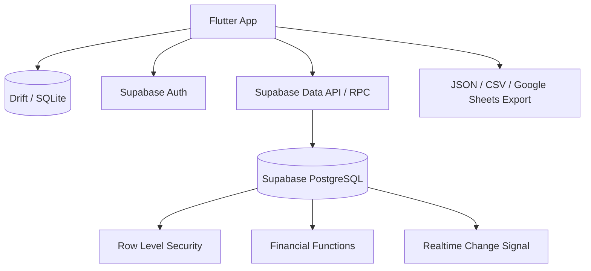
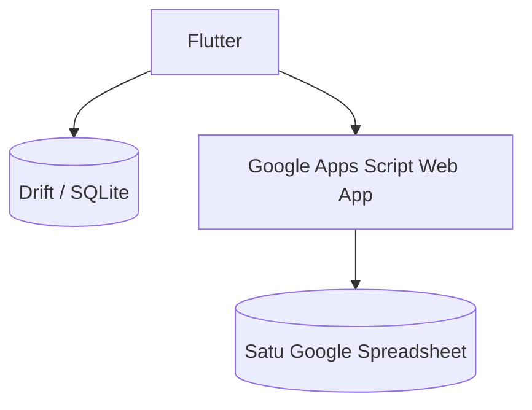

# Architecture Decision Record

## Bekara — Supabase, Offline Cache, dan Alternatif Google Spreadsheet

| Informasi | Nilai |
|---|---|
| Status | Diterima untuk implementasi awal |
| Tanggal | 4 Agustus 2026 |
| Target pengguna | Satu keluarga kecil, awalnya suami dan istri |
| Biaya operasional target | Gratis selama berada dalam batas free tier |
| Arsitektur utama | Flutter + Drift/SQLite + Supabase Free |
| Alternatif terdokumentasi | Flutter + Drift/SQLite + Google Apps Script + Google Spreadsheet |

## 1. Keputusan

Bekara menggunakan:

- Flutter untuk aplikasi mobile.
- Drift/SQLite sebagai database lokal, cache, draft, dan antrean sinkronisasi.
- Supabase Auth untuk autentikasi.
- PostgreSQL Supabase sebagai sumber kebenaran data bersama.
- Row Level Security (RLS) untuk pembatasan akses per pengguna dan household.
- PostgreSQL functions/RPC untuk operasi finansial atomik.
- Supabase Realtime hanya sebagai pemicu refresh, bukan sumber kebenaran.
- Ekspor JSON/CSV dan Google Spreadsheet sebagai backup/laporan manual.

Spring Boot, VPS, Redis, dan server aplikasi khusus tidak digunakan pada rilis pribadi awal.

## 2. Alasan

Supabase dipilih karena menyediakan database relasional, autentikasi, API, kontrol akses, dan transaksi database tanpa mengharuskan pemilik mengelola server. PostgreSQL lebih sesuai daripada spreadsheet atau database dokumen untuk ledger, transfer dua sisi, audit trail, periode terkunci, constraint, dan laporan keuangan.

Free tier adalah batas operasional, bukan jaminan permanen. Kebijakan penyedia dapat berubah. Aplikasi harus dapat mengekspor seluruh data agar migrasi tetap mungkin.

## 3. Arsitektur utama



### 3.1 Tanggung jawab Flutter

- Menyimpan data yang diperlukan untuk penggunaan offline.
- Menyimpan transaksi baru sebagai `PENDING_SYNC`.
- Mengirim `client_reference_id` yang stabil pada setiap retry.
- Menampilkan data terakhir yang telah tersinkron.
- Menangani konflik secara eksplisit, bukan diam-diam menimpa data server.
- Tidak menghitung saldo final yang berbeda dari aturan server.

### 3.2 Tanggung jawab Supabase/PostgreSQL

- Menjadi sumber kebenaran bersama.
- Memvalidasi membership dan kepemilikan data.
- Menjalankan transfer dan posting ledger dalam satu transaksi database.
- Menolak perubahan pada periode terkunci.
- Menjaga idempotensi.
- Membentuk audit trail.
- Menghasilkan query saldo dan laporan yang konsisten.

### 3.3 Tanggung jawab Realtime

Realtime hanya memberi tahu perangkat bahwa data berubah. Setelah menerima event, perangkat tetap mengambil data kanonis dari API. Aplikasi tidak boleh menganggap event Realtime sebagai ledger final.

## 4. Model saldo yang disepakati

- Setiap wallet memiliki tepat satu pemilik pengguna.
- `personal balance` adalah total wallet aktif milik pengguna.
- `member balance` adalah saldo per masing-masing anggota.
- `shared family balance` adalah total wallet aktif dengan `is_shared = true`.
- `global household balance` adalah total seluruh wallet kas aktif milik anggota aktif.
- Semua anggota aktif dapat melihat saldo wallet anggota lain.
- Detail transaksi tetap mengikuti scope dan privacy mode.
- Transaksi pribadi dari wallet bersama mengubah personal, family, dan global balance, tetapi tidak masuk household spending.
- Household spending hanya menghitung transaksi dengan scope `HOUSEHOLD`.

Dompet kredit (`CREDIT_CARD` dan `PAYLATER`) tidak masuk saldo kas. Kewajibannya dilaporkan terpisah.

## 5. Model periode

Sistem memiliki dua konfigurasi periode:

- Periode pribadi per anggota, mengikuti siklus pendapatan anggota tersebut.
- Periode household tunggal untuk laporan bersama.

Contoh:

```text
Suami     : 25–24
Istri     : 10–9
Household : 25–24
```

Status periode:

```text
OPEN -> REVIEWED -> LOCKED
```

Aturan awal:

- Periode aktif dapat diedit.
- Satu periode sebelumnya tetap dapat dikoreksi selama belum terkunci.
- Periode yang lebih lama dikunci otomatis.
- Owner dapat melakukan review dan mengunci lebih cepat.
- Data pada periode terkunci dikoreksi melalui reversal/adjustment di periode aktif.

Aturan auto-lock ini berstatus **provisional** sampai perilaku review manual diputuskan secara final.

## 6. Strategi offline dan sinkronisasi

### 6.1 Status lokal

```text
LOCAL_DRAFT
PENDING_SYNC
SYNCING
SYNCED
SYNC_FAILED
CONFLICT
```

### 6.2 Alur push

1. Mobile membuat UUID `client_reference_id`.
2. Data disimpan ke SQLite.
3. Mobile memanggil RPC yang sesuai ketika online.
4. Server memvalidasi idempotensi, membership, versi, dan status periode.
5. Server menyimpan aggregate, posting, dan audit secara atomik.
6. Mobile menyimpan ID server dan `server_version`.

### 6.3 Alur pull

- Setiap tabel sinkronisasi memiliki `updated_at` dan monotonic `change_sequence` atau cursor ekuivalen.
- Mobile menyimpan cursor terakhir per household.
- Pull harus mencakup tombstone/soft delete.
- Full resync tersedia bila cursor rusak atau terlalu lama.

### 6.4 Konflik

- Create memakai idempotency key.
- Update memakai optimistic version.
- Payload berbeda dengan idempotency key yang sama menghasilkan konflik.
- Periode terkunci selalu mengalahkan perubahan lokal yang belum tersinkron.
- Konflik tidak diselesaikan dengan `last write wins` untuk data finansial.

## 7. Keamanan

- Aplikasi hanya menyimpan publishable/anon key; service-role key tidak pernah ditanam di mobile.
- Semua tabel domain mengaktifkan RLS.
- Operasi finansial kritis hanya melalui RPC dengan validasi membership di database.
- Function memakai `security invoker` secara default. Function `security definer` hanya digunakan bila perlu dan wajib menetapkan `search_path` aman.
- Token disimpan melalui secure storage perangkat.
- Ekspor dan backup harus dibuat oleh pengguna yang terautentikasi.

## 8. Backup dan portability

Free tier tidak dianggap sebagai backup. Aplikasi harus menyediakan:

- Ekspor penuh JSON untuk pemulihan mesin.
- Ekspor CSV untuk pembacaan manusia.
- Manifest versi schema pada setiap backup.
- Checksum file backup.
- Restore tervalidasi dan bersifat idempotent.
- Pengingat backup manual berkala.

Google Spreadsheet boleh menerima ekspor satu arah, tetapi bukan ledger kanonis.

## 9. Alternatif: Google Apps Script + Spreadsheet

Alternatif ini dicatat jika Supabase tidak dapat digunakan.



### 9.1 Struktur alternatif

Gunakan satu file spreadsheet, bukan tiga file terpisah:

```text
households
members
wallets
categories
transactions
ledger_entries
transfers
financial_periods
audit_logs
sync_state
```

Data suami dan istri dibedakan menggunakan `owner_user_id`. Pemisahan file suami, istri, dan bersama ditolak karena transfer lintas file tidak dapat dijamin atomik.

### 9.2 Syarat minimum

- Spreadsheet tidak diedit manual.
- Apps Script menjadi satu-satunya jalur tulis.
- Semua record menggunakan UUID.
- Ledger bersifat append-only.
- `LockService` digunakan untuk mengurangi concurrent write.
- Idempotency key disimpan dan divalidasi.
- Apps Script memverifikasi allowlist akun Google.
- Backup spreadsheet dibuat berkala.

### 9.3 Keterbatasan yang diterima

- Tidak memiliki constraint dan transaksi relasional setara PostgreSQL.
- Privasi lemah jika file dibagikan langsung kepada kedua pengguna.
- Quota dan batas runtime Apps Script dapat menghentikan sinkronisasi.
- Laporan dan sinkronisasi melambat ketika baris bertambah.
- Migrasi schema dan recovery lebih manual.

Karena keterbatasan ini, opsi spreadsheet berstatus **fallback/prototype only**, bukan arsitektur utama.

## 10. Alternatif lain yang dipertimbangkan

| Alternatif | Keputusan | Alasan |
|---|---|---|
| Firebase Spark | Tidak dipilih | NoSQL membuat ledger dan laporan relasional lebih kompleks |
| Cloudflare Workers + D1 | Cadangan teknis | Gratis dan SQL, tetapi API serta autentikasi harus dibangun sendiri |
| Server rumah | Tidak dipilih | Membutuhkan perangkat aktif, jaringan, backup, dan maintenance |
| Spring Boot di VPS | Ditunda | Menambah biaya/operasional yang tidak diperlukan untuk dua pengguna |

## 11. Exit strategy

Lapisan akses data Flutter harus menggunakan interface agar Supabase dapat diganti:

```text
FinanceRepository
├── LocalFinanceRepository
├── SupabaseFinanceRepository
└── SpreadsheetFinanceRepository (opsional/fallback)
```

Model domain dan ID tidak boleh bergantung pada ID baris spreadsheet atau detail internal Supabase.

## 12. Keputusan belum final

- Apakah semua detail transaksi pribadi benar-benar boleh disembunyikan, sementara saldo wallet selalu terlihat.
- Siapa yang menetapkan household reporting cycle pertama kali dan siapa yang boleh mengubahnya.
- Apakah auto-lock selalu dilakukan setelah melewati satu periode, atau hanya setelah owner menekan review.
- Apakah pasangan boleh mengedit transaksi pribadi atau hanya memberi correction note.
- Apakah aplikasi pertama hanya Android atau juga iOS.
- Frekuensi backup manual dan lokasi penyimpanannya.
- Apakah Google Sheets export satu arah dijadwalkan otomatis atau hanya saat tombol ditekan.
