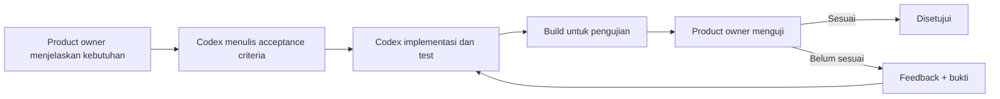

# Workflow Product Owner, Codex, dan Tester

## 1. Model kerja

Product owner memberikan tujuan, contoh penggunaan, aturan bisnis, dan feedback. Codex mengelola code, migration, test, dokumentasi, dan build. Product owner tidak diwajibkan menyentuh source code.



## 2. Format permintaan fitur

Product owner cukup memberikan:

```text
Tujuan:
Siapa yang menggunakan:
Alur yang diinginkan:
Contoh data:
Hasil yang diharapkan:
Hal yang tidak boleh terjadi:
```

Codex bertanggung jawab mengubahnya menjadi task teknis dan mengangkat pertanyaan hanya bila keputusan akan mengubah perilaku produk secara material.

## 3. Handoff setiap perubahan

Setiap fitur harus diserahkan bersama:

- Ringkasan perilaku yang selesai.
- File/area yang berubah.
- Migration yang dijalankan.
- Test otomatis dan hasilnya.
- Cara menjalankan build.
- Skenario manual yang harus diuji.
- Known limitation.
- Keputusan/TBD baru bila ada.

## 4. Format laporan bug dari tester

```text
Judul:
Perangkat dan versi Android:
Versi/build aplikasi:
Kondisi internet: online/offline/berubah
Akun/peran: owner/member
Langkah reproduksi:
Hasil aktual:
Hasil yang diharapkan:
Screenshot/video:
Waktu kejadian:
Apakah selalu terjadi:
```

Jangan menyertakan password, access token, service-role key, atau data sensitif dalam screenshot/log.

## 5. Definition of ready

Fitur siap dikerjakan bila tujuan, actor, alur utama, acceptance criteria, dampak saldo/privasi, dan perilaku offline cukup jelas. Default teknis boleh dipilih Codex selama tidak mengubah keputusan produk.

## 6. Definition of done

- Acceptance criteria terpenuhi.
- Analyzer dan test relevan lulus.
- Migration dapat diterapkan dari database kosong.
- RLS dan privacy test tersedia untuk perubahan data.
- Offline/retry diuji jika fitur membuat mutation.
- Dokumentasi diperbarui.
- Tester menerima build dan skenario uji.
- Product owner menyatakan hasil sesuai.

## 7. Hal yang tetap membutuhkan product owner

- Membuat dan memiliki akun Supabase.
- Menentukan email suami/istri untuk pengujian.
- Menjaga credential dan recovery account.
- Menjalankan pengujian pengalaman nyata pada ponsel.
- Memilih perilaku produk yang belum final.
- Memberikan persetujuan untuk deployment atau tindakan eksternal yang berdampak.
- Menyediakan Mac jika kelak membutuhkan build iOS.

Codex tidak menggantikan keputusan produk dan tidak dapat menilai kenyamanan penggunaan di perangkat nyata tanpa feedback tester.

## 8. Strategi build pribadi

- Fase awal menggunakan APK debug/internal.
- Setiap build memiliki nomor versi dan catatan perubahan.
- Data uji dipisahkan dari data pribadi sebenarnya sampai migration dan backup stabil.
- Sebelum memakai data nyata, restore backup harus pernah diuji.
- Release build dan signing key disiapkan setelah fitur inti stabil.
